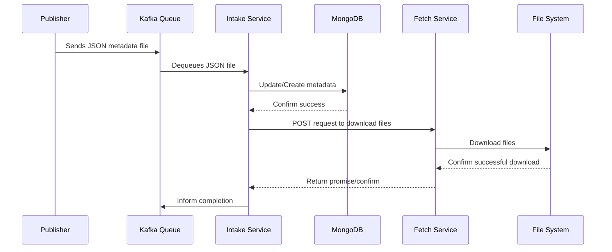
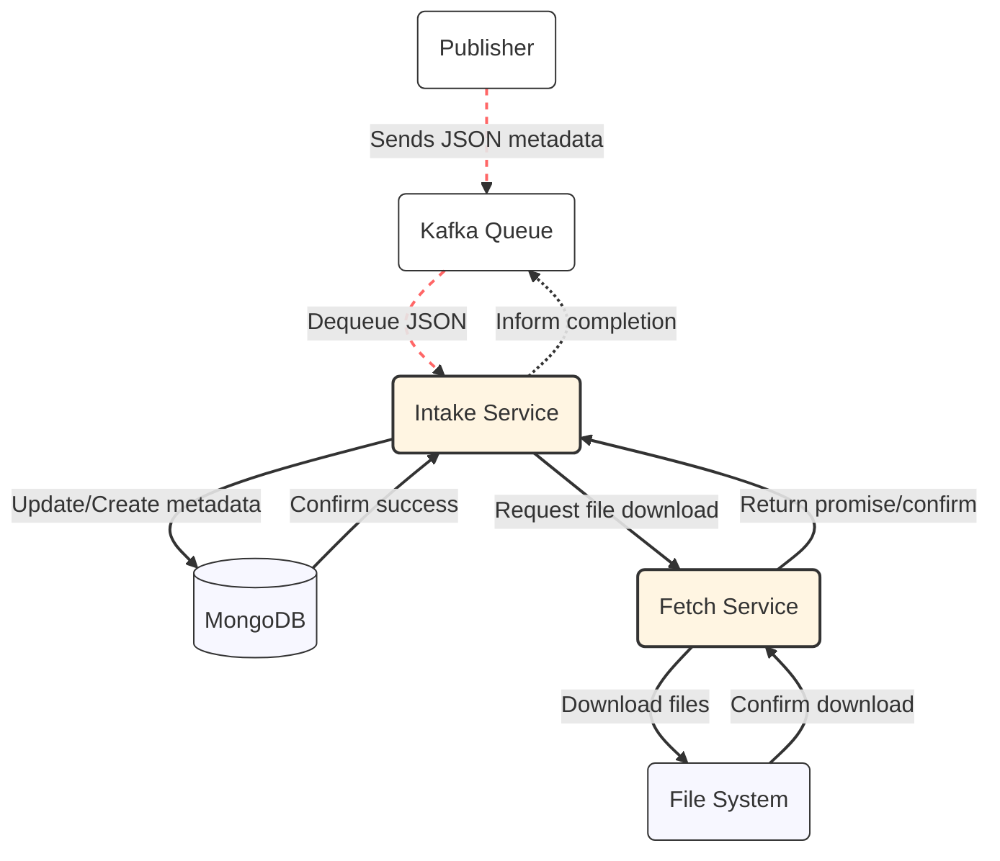

## Architecture

### Description of the Overall System Architecture

The architecture consists of several key components including the Kafka messaging system, the Intake Service, and the Fetch Service, which interact through defined protocols to manage the flow of data efficiently across the system.

### Roles and Responsibilities of Each Component

<AccordionGroup>
	<Accordion title="Kafka Intake Queue">
		<Card 
				title="Kafka Intake Queue" 
				icon="pipe-circle-check"
				href="/onix-intake-pipeline/services/kafka-queue"
			>
				Manages the queue of incoming JSON metadata for processing.
			</Card>
		<AccordionGroup>
			<Accordion title="Process Flow">
				1. Receives and prioritizes incoming JSON metadata files into the processing queue.
				2. Ensures the stability and continuity of message intake even under heavy load.
				3. Delegates messages to the Onix Orchestration service for further processing.
			</Accordion>
			<Accordion title="Responsibilities">
				- Manages the queuing of incoming JSON metadata files to ensure orderly processing.
				- Monitors the health and performance of the message queue to prevent data loss or backlog.
				- Provides resilience and scalability features to handle varying loads and potential system failures.
			</Accordion>
			<Accordion title="Technologies Used">
				- Apache Kafka for robust messaging and queuing capabilities.
				- Custom Kafka Consumer APIs for optimized message consumption.
				- Monitoring tools integrated with Kafka for real-time analytics and operational visibility.
			</Accordion>
		</AccordionGroup>
	</Accordion>
	<Accordion title="Onix Orchestration">
		<Card 
			title="Onix Orchestration" 
			icon="diagram-subtask"
			href="/onix-intake-pipeline/services/kafka-queue"
		>
			Processes messages from Kafka to update the MongoDB database and initiates file download requests.
		</Card>
		<AccordionGroup>
			<Accordion title="Process Flow">
				1. Consumes messages from Kafka
				2. Parses and validates the data
				3. Updates MongoDB with new or updated metadata
				4. Sends download requests to the Fetch Service or handles failures
			</Accordion>
			<Accordion title="Responsibilities">
				- Consuming messages from Kafka
				- Updating records in MongoDB
				- Handling success or failure responses
			</Accordion>
			<Accordion title="Technologies Used">
				- Node.js for runtime
				- Kafka client for message consumption
				- MongoDB driver for database interactions
			</Accordion>
		</AccordionGroup>
	</Accordion>
	<Accordion title="Content Fetcher">
		<Card 
			title="Content Fetcher" 
			icon="sink"
			href="/onix-intake-pipeline/services/content-fetcher"
		>
			Handles the downloading of files based on requests from the Intake Service and reports back upon success or failure.
		</Card>
		<AccordionGroup>
			<Accordion title="Process Flow">
				1. Receives download commands from the Intake Service
				2. Executes file downloads from specified URLs
				3. Returns success or failure notifications to the Intake Service
			</Accordion>
			<Accordion title="Responsibilities">
				- Downloading files as requested by the Intake Service
				- Notifying the Intake Service upon completion
			</Accordion>
			<Accordion title="Technologies Used">
				- Node.js for runtime
				- Various file handling libraries to manage downloads
			</Accordion>
		</AccordionGroup>
	</Accordion>
	<Accordion title="Content Metadata: MongoDB">
		<Card 
			title="Content Metadata Database" 
			icon='database'
			href="/onix-intake-pipeline/databases/content-metadata"
		>
			Stores and manages the metadata.
		</Card>
		<AccordionGroup>
			<Accordion title="Process Flow">
				1. Receives data from Onix Orchestration
				2. Validates and processes data
				3. Stores updated metadata records securely
			</Accordion>
			<Accordion title="Responsibilities">
				- Storing and managing JSON metadata efficiently
				- Ensuring data integrity and consistency
				- Providing fast retrieval capabilities for system queries
			</Accordion>
			<Accordion title="Technologies Used">
				- MongoDB for database management
				- Secure access mechanisms to protect data privacy
				- Backup and recovery solutions to safeguard data
			</Accordion>
		</AccordionGroup>
	</Accordion>
	<Accordion title="Content Data: File Server">
		<Card 
			title="File System" 
			icon='server'
			href="/onix-intake-pipeline/databases/content-metadata"
		>
			Stores and manages the content.
		</Card>
		<AccordionGroup>
			<Accordion title="Process Flow">
				1. Receives file download requests from the Fetch Service
				2. Stores files securely in the specified directories
				3. Manages file access permissions and retrieval
			</Accordion>
			<Accordion title="Responsibilities">
				- Secure storage of digital content files
				- Efficient file management and access control
				- Handling high-volume data with minimal latency
			</Accordion>
			<Accordion title="Technologies Used">
				- High-performance file servers
				- Redundant storage systems to prevent data loss
				- Network security protocols to ensure secure file transfers
			</Accordion>
		</AccordionGroup>
	</Accordion>
</AccordionGroup>

## Diagrams

### System Diagram

<Frame>
	
	
</Frame>

### Sequence

### Flowchart

