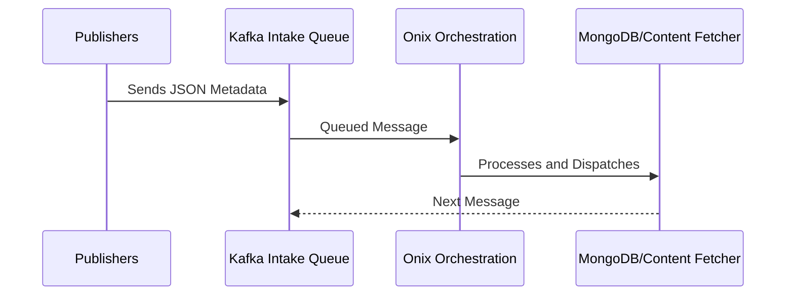

## Overview

The Kafka Intake Queue is crucial for the initial intake of JSON metadata files, managing their queuing and preliminary processing efficiently. This component is essential for maintaining data integrity and system performance throughout the Onix Intake Pipeline.

## Architecture

<AccordionGroup>
  <Accordion title="Technical Architecture">
    Utilizing Apache Kafka's distributed system, the Kafka Intake Queue handles large volumes of incoming messages. Designed for scalability, it supports increasing throughput with additional Kafka brokers as system demands grow.
  </Accordion>
</AccordionGroup>

## Process Flow



## Responsibilities

<AccordionGroup>
  <Accordion title="Main Responsibilities">
    - **Message Queuing:** Efficient queuing of incoming JSON metadata.
    - **Load Management:** Distributes workload to prevent system bottlenecks.
    - **Fault Tolerance:** Maintains high availability through robust replication and partitioning.
  </Accordion>
</AccordionGroup>

## Technologies Used

<AccordionGroup>
  <Accordion title="Key Technologies">
    - **Apache Kafka:** For high-throughput and fault-tolerant message queuing.
    - **Node.js Kafka Client (like kafkajs):** Allows Node.js applications to produce and consume messages from Kafka, integrating seamlessly with Kafka brokers.
    - **Zookeeper:** Manages broker coordination, ensuring stable cluster operation.
  </Accordion>
</AccordionGroup>

## Configuration and Setup

Using Node.js with Kafka involves setting up a client that can produce and consume messages effectively. Here’s a basic setup using the kafkajs library:

```typescript Typescript
import { Kafka, Producer, Consumer } from 'kafkajs';

const kafka = new Kafka({
  clientId: 'my-app',
  brokers: ['kafka1:9092', 'kafka2:9092']
});

const producer: Producer = kafka.producer();
const consumer: Consumer = kafka.consumer({ groupId: 'test-group' });

// Code to connect producer/consumer and handle messages
```

## Monitoring and Management

To ensure the Kafka Intake Queue operates efficiently, it's essential to implement monitoring solutions that are robust yet cost-effective.

<AccordionGroup>
  <Accordion title="Monitoring Tools">
    - **Kafka Minion:** An open-source monitoring tool to gather detailed Kafka metrics.
    - **Prometheus:** Stores time-series data and monitors Kafka with powerful querying capabilities.
    - **Grafana:** Visualizes the data collected from Prometheus, providing dashboards for real-time monitoring.
  </Accordion>
  <Accordion title="Management Practices">
    - **Regular Health Checks:** Keeps track of Kafka broker health and performance.
    - **Log Compaction:** Regularly compacts and cleans Kafka logs to maintain performance.
    - **Backup and Recovery:** Strategically backs up data to mitigate potential data loss scenarios.
  </Accordion>
</AccordionGroup>

## Best Practices

<AccordionGroup>
  <Accordion title="Optimization Tips">
    - **Adequate Partitioning:** Enhances load distribution across Kafka brokers.
    - **Replica Management:** Ensures data durability with appropriate topic replication settings.
    - **Producer/Consumer Optimization:** Tailors configurations to meet specific throughput and latency needs.
  </Accordion>
</AccordionGroup>
