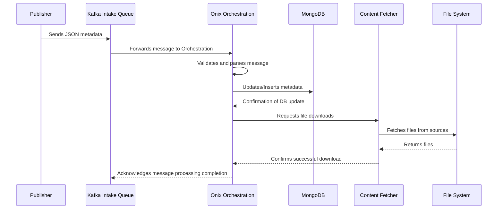

## Overview

### Purpose of the Service

The Onix Orchestration service acts as the central processing unit of the Onix Intake Pipeline, handling the consumption, processing, and coordination of tasks between the Kafka Intake Queue and other components such as MongoDB and the Content Fetcher.

### High-Level Process Flow

This service is responsible for pulling messages from the Kafka queue, processing those messages to update MongoDB, and initiating file downloads through the Content Fetcher service.

## Architecture

### Service Design

The service integrates directly with Kafka to receive messages and uses Node.js to efficiently process and route these messages to the appropriate components.

### Component Interaction

<CardGroup cols={2}>
  	<Card 
  		title="Kafka Intake Queue" 
		icon="pipe-circle-check"
		href="/onix-intake-pipeline/services/kafka-queue"
	>
    	Receives and parses incoming JSON metadata
  	</Card>
	  	<Card 
  		title="Content Metadata Database" 
		icon='database'
  		href="/onix-intake-pipeline/databases/content-metadata"
	>
    	Updates and queries the database based on processed data
 	</Card>
  	<Card 
  		title="Content Fetcher" 
		icon="sink"
		href="/onix-intake-pipeline/services/content-fetcher"
	>
   		Requests file downloads and handles the results
  	</Card>
</CardGroup>

## Detailed Workflow

### Message Consumption

<Steps>
  <Step title="Consume">
    Retrieves messages from the Kafka queue, ensuring data integrity and handling potential errors gracefully.
  </Step>
  <Step title="Validate">
    Validates the format and completeness of the incoming data before processing.
  </Step>
  <Step title="Log">
    Logs the incoming data and any pertinent processing steps for troubleshooting and audit purposes.
  </Step>
</Steps>

### Data Processing

<Steps>
  <Step title="Update MongoDB">
    Updates records in MongoDB with new or revised metadata from the incoming messages.
  </Step>
  <Step title="Dispatch Downloads">
    Sends download requests to the Content Fetcher service for necessary files associated with the current metadata.
  </Step>
  <Step title="Handle Responses">
    Receives confirmation of successful downloads or error notifications from the Content Fetcher.
  </Step>
</Steps>

### Process Flow

### Error Handling and Retry Logic

<AccordionGroup>
  <Accordion title="Retry Mechanisms">
    Implements retry logic for message consumption and processing to handle transient failures effectively.
  </Accordion>
  <Accordion title="Error Notifications">
    Sends alerts and notifications to system administrators or logs them for later review when errors occur.
  </Accordion>
  <Accordion title="Data Integrity Checks">
    Ensures data integrity throughout the process with checksums and validations against database records.
  </Accordion>
</AccordionGroup>

## Technologies Used

  - **Node.js**: For service runtime
  - **KafkaJS**: To interface with Kafka
  - **MongoDB Driver**: For database operations

## Monitoring and Logging

Provides comprehensive monitoring and logging capabilities to track the health and performance of the service in real-time.

## Security Measures

Adopts standard security practices such as encrypted connections and secure handling of data to protect against unauthorized access.
